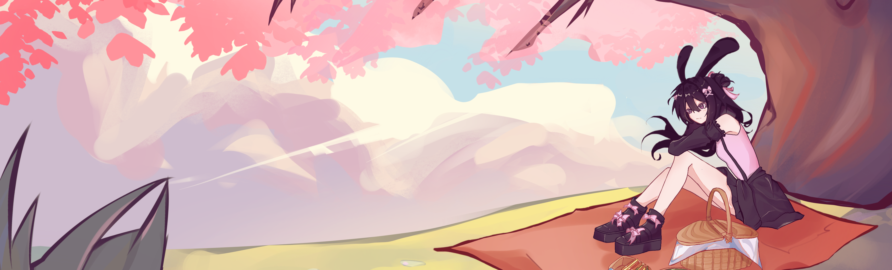
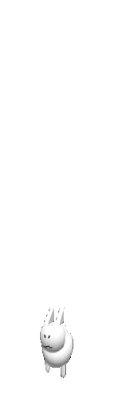

  

<h1 align="center">Hello, I'm A04987 / Moji</h1>

  <b>Roblox Animator</b> &bull; <b>Artist</b> &bull; <b>Developer</b> &bull; <b>Dreamer</b>

  I love creating stories through animation, character visuals, and cozy digital spaces.
   
  Inspired by anime, fantasy worlds, Roblox communities, and soft profile aesthetics.

---

### About Me

  I make animation and artwork for characters, profiles, and community projects.
   
  Sometimes coding, sometimes drawing, usually building something cute.

---

### Stats & Languages

  
  

---

### Social Media

  

  
  &nbsp;&nbsp;
  
  &nbsp;&nbsp;
  

---

  
  &nbsp;&nbsp;&nbsp;&nbsp;
  

  <i>"bnuy"</i>

